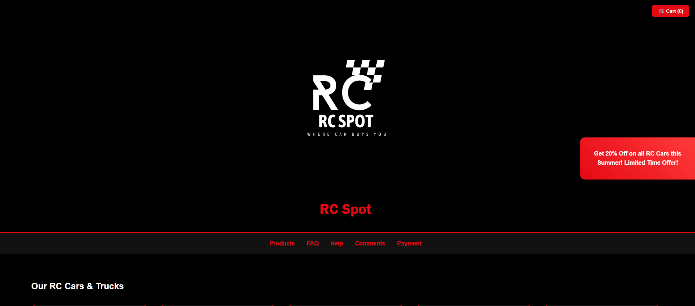
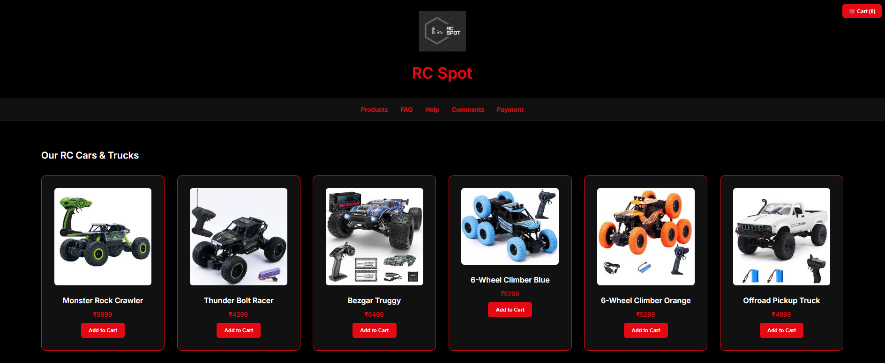
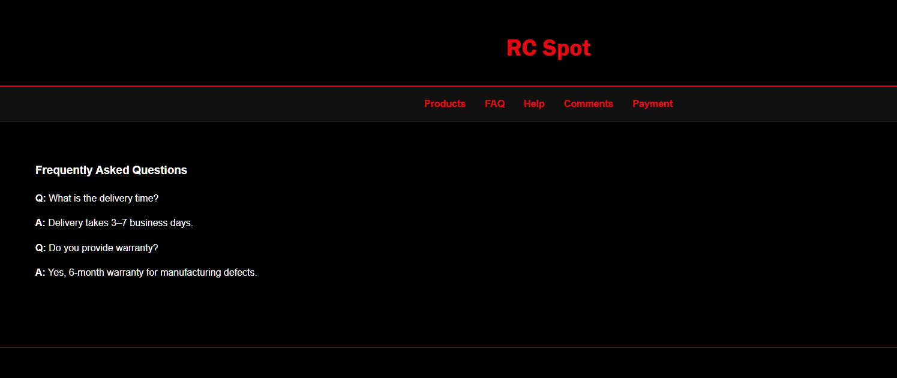
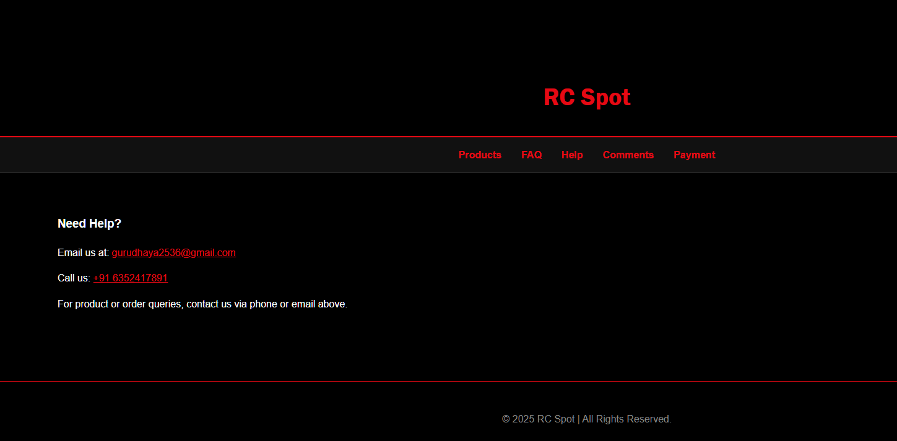
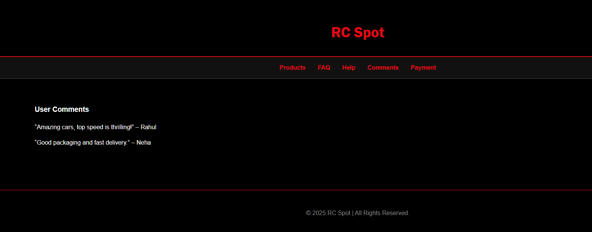
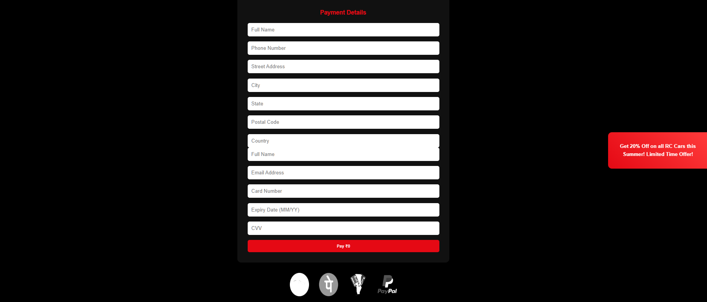

# 🏎️ RC Spot

[](https://github.com/Dharsh606/rcspot/stargazers)
[](https://github.com/Dharsh606/rcspot/network/members)
[](https://github.com/Dharsh606/rcspot/issues)
[](./LICENSE)
[![Live Demo][([https://img.shields.io/badge/Live%20Demo-Click%20Here-brightgreen](https://dharsh606.github.io/rcspot/)](https://dharsh606.github.io/rcspot/))](https://dharsh606.github.io/rcspot/)

> **RC Spot** is a modern e-commerce website for RC (Remote Control) cars and accessories.  
> Built with passion by **Dharshan V**, this project offers a smooth shopping experience with cart management, checkout, and invoice generation.

---

## 🚀 Live Demo  

🔗 [View RC Spot Live](https://dharsh606.github.io/rcspot/)  

---

## 📸 Screenshots  

### 🏠 Homepage  

   
   
   
  
  


---

## ✨ Features  

- 🎥 Video intro banner for immersive shopping  
- 📦 Product catalog with detailed descriptions  
- 🛒 Advanced cart system (like Amazon)  
- 💳 Checkout flow with payment and invoice pages  
- 📱 Modern, responsive, dark-themed UI inspired by BMW’s official site  
- 🔄 Smooth transitions and animations for a premium feel  

---

## 🛠️ Technologies Used  

- **Frontend:** HTML, CSS (Tailwind CSS), JavaScript  
- **Design:** Animations & transitions (modern UI/UX approach)  
- **Future Integrations:** Backend, payments, PWA, and admin dashboard  

---

## ⚙️ Installation & Setup  

1. Clone the repository  
   ```bash
   git clone https://github.com/Dharsh606/rcspot.git
   cd rcspot

      
## 👤 Author

Made with ❤️ by **Dharshan V**  
🔗 [Connect with me on LinkedIn](https://www.linkedin.com/in/dharshanvreddy/)

---

   ## 📜 LICENSE (MIT)  

```text
MIT License

Copyright (c) 2025 DHARSHAN V REDDY

Permission is hereby granted, free of charge, to any person obtaining a copy
of this software and associated documentation files (the “Software”), to deal
in the Software without restriction, including without limitation the rights
to use, copy, modify, merge, publish, distribute, sublicense, and/or sell
copies of the Software, and to permit persons to whom the Software is
furnished to do so, subject to the following conditions:

The above copyright notice and this permission notice shall be included in
all copies or substantial portions of the Software.

THE SOFTWARE IS PROVIDED “AS IS”, WITHOUT WARRANTY OF ANY KIND, EXPRESS OR
IMPLIED, INCLUDING BUT NOT LIMITED TO THE WARRANTIES OF MERCHANTABILITY,
FITNESS FOR A PARTICULAR PURPOSE AND NONINFRINGEMENT. IN NO EVENT SHALL THE
AUTHORS OR COPYRIGHT HOLDERS BE LIABLE FOR ANY CLAIM, DAMAGES OR OTHER
LIABILITY, WHETHER IN AN ACTION OF CONTRACT, TORT OR OTHERWISE, ARISING FROM,
OUT OF OR IN CONNECTION WITH THE SOFTWARE OR THE USE OR OTHER DEALINGS IN
THE SOFTWARE.
